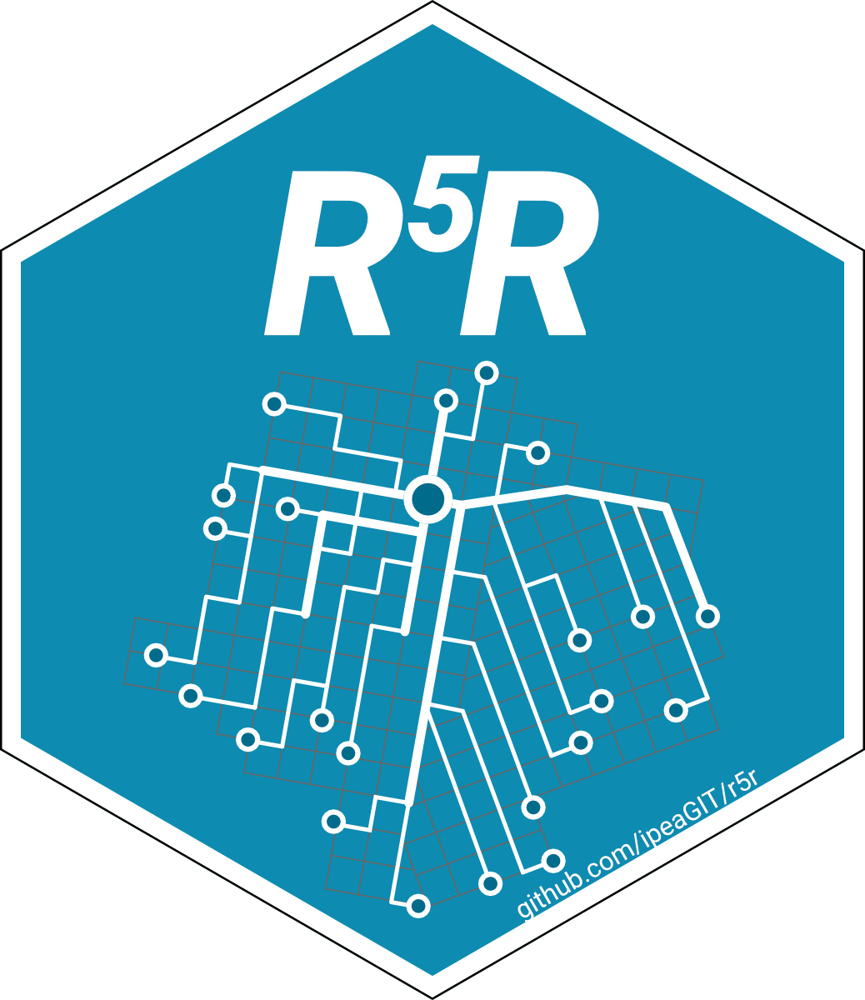
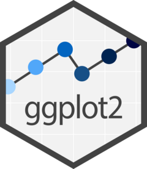
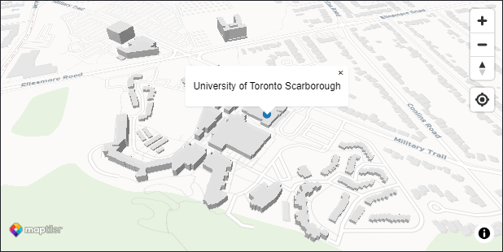

<h1 align="center">Hi 👋, I'm Zehui Yin</h1>
<h3 align="center">Undergraduate Student at University of Toronto Scarborough</h3>
<h3 align="center">Incoming Geography PhD Student at McMaster University</h3>

- 👨‍💻 My selected projects are available at [Data Visualization](https://zehuiyin.github.io/data_visualization.html) or [Analysis](https://zehuiyin.github.io/data_analysis.html)

- 💬 Ask me about [*R*](https://www.r-project.org/) and [*GIS*](https://en.wikipedia.org/wiki/Geographic_information_system)

- 📫 How to reach me **zehui.yin@mail.utoronto.ca**/**zehuiyin@gmail.com**

- 📄 Know about my experiences [CV.pdf](https://zehuiyin.github.io/files/CV.pdf)

<h3 align="left">Connect with me:</h3>

   &nbsp;
   &nbsp;
  

<h3 align="left">Programming Languages & Software:</h3>

 
   &nbsp;
   &nbsp;
   &nbsp;
   &nbsp;
   &nbsp;
  

<h3 align="left">Data Analysis and Visualization Packages in <i>R</i>:</h3>

 
   &nbsp;
   &nbsp;
   &nbsp;
   &nbsp;
   &nbsp;
  

<h3 align="left">Find me at:</h3>

 
  

