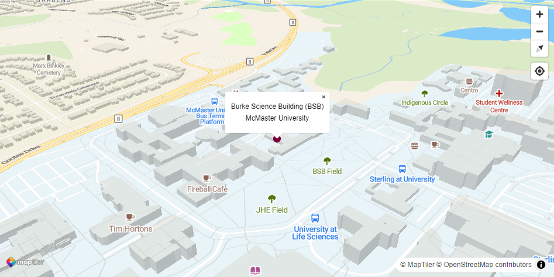

<h1 align="center">Hi 👋, I'm Zehui Yin (殷泽辉)</h1>
<h3 align="center">Geography PhD Student at McMaster University</h3>

- 👨‍💻 My selected projects are available at [Data Analysis](https://zehuiyin.github.io/data_analysis.html) and [Data Visualization](https://zehuiyin.github.io/data_visualization.html)

- 💬 Ask me about [GIS](https://en.wikipedia.org/wiki/Geographic_information_system) and [Data Science](https://en.wikipedia.org/wiki/Data_science) in [R](https://www.r-project.org/) and [Python](https://www.python.org/)

- 📫 Reach me at yinz39@mcmaster.ca or zehuiyin@gmail.com

- 📄 Know about my experiences at [Personal Website](https://zehuiyin.github.io/) and [CV.pdf](https://zehuiyin.github.io/files/CV.pdf)

<h3 align="left">Connect with me:</h3>

  &emsp;
  &emsp;
  &emsp;
  

<h3 align="left">Programming Languages & Software:</h3>

  &emsp;
  &emsp;
  &emsp;
  &emsp;
  &emsp;
  

<h3 align="left">Find me at:</h3>

 
  

